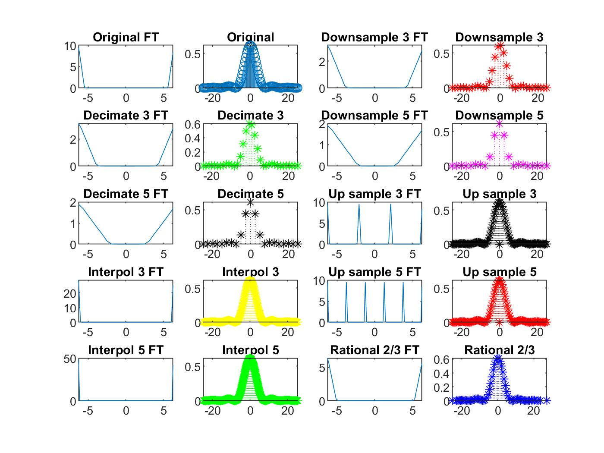

# Signals-and-some-manipulations

## Introduction: 

Let's assume we are given a signal x(t), continuous and differentiable.

<em>exempli gratia</em> :

Now, regarding a practical analysis we can't generate a signal such that we get infinite precision. Thus, to address the signals in real life we can use sampling methods that shall render our signal in a very good approximation. Such a method will convert our signal from a continuous domain to a discrete one.

Also let us define a sampling interval T, and we will get a discrete signal x. Formulated as:

Sampling Example:

In signal processing some tools are introduced for various reasons and to assist in different scenarios. Some of which are: Upsampling, Downsampling, Interpolating and Decimating.

Their definitions are given as:

#### Upsampling: 

#### Downsampling:

#### Interpolating: 

We design a system using upsampling, such is given as:

#### Decimating:

We design a system using downsampling, given by:

Now let's take an <em>e.g.</em>

That can be written as:

 Now we could run the simulation on MATLAB and Python and get:

[MATLAB]: remark it was developed using of the MATLAB Signal Processing Toolbox

[Python]: remark it was developed using numpy, matplotlib and scipy libraries

